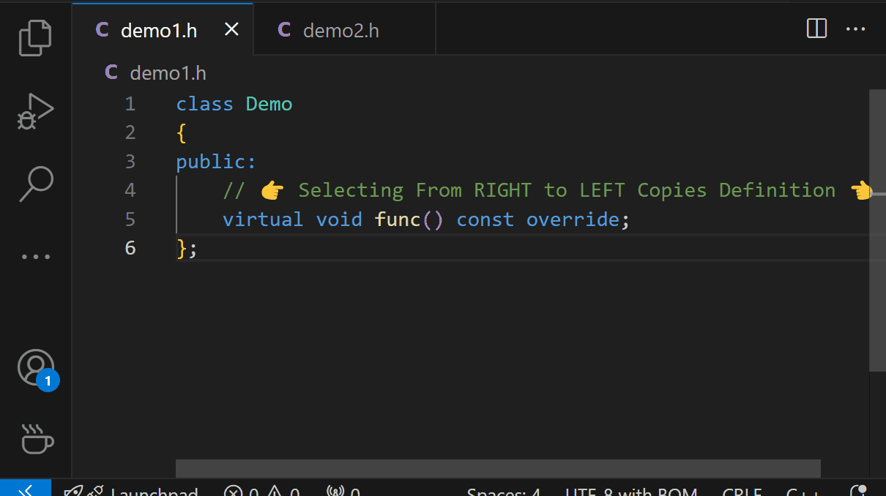

# C++ Definition Paster

🌏 [中文](README.zh-CN.md) | [English](README.md)

## Usage

Select a function prototype from **RIGHT to LEFT**, then press `Ctrl`+`C` to copy its definition. If you select in the opposite direction, `Ctrl`+`C` will function normally.

This extension is still in early development. Any feedback would be greatly appreciated!
