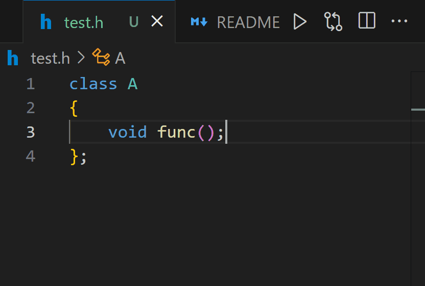

# C++ Definition Paster README

A simple tool to help you generate c++ definitions.

## Quick Start

1. Select or place the cursor inside a function prototype.

// todo update this
## Tips

- You can use `ctrl+insert` to enforce a normal copy.

- If you want to change the key binding, go to File - Preferences - Keyboard Shortcuts and search for `cpp-def-paster.copyDefinition`.

This extension is still in early development; any feedback would be greatly appreciated!
