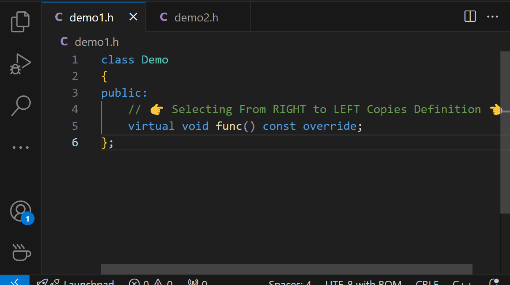

# C++ 定义粘贴器

🌏 [中文](README.zh-CN.md) | [English](README.md)

## 使用方法

**从右到左**选择一个函数原型，然后按 `Ctrl`+`C` 复制其定义。如果从左到右选择，`Ctrl`+`C` 将正常复制。

This extension is still in early development. Any feedback would be greatly appreciated!
